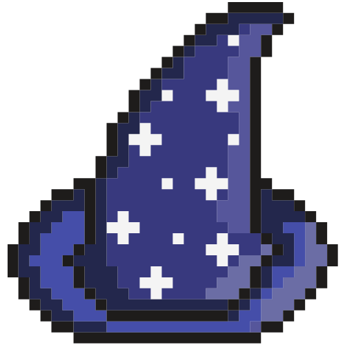
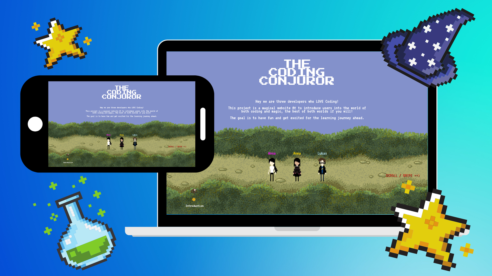

 

  

  <h3 align="center">Coding Conjuror</h3>

  

 Gamifying the first steps of learning Javascript!
     
     
    <a href="https://lukaskreibig.github.io/codingConjurors/">View Demo</a>
    ·
    <a href="https://github.com/lukaskreibig/codingConjurors/issues">Report Bug</a>
    ·
    <a href="https://github.com/lukaskreibig/codingConjurors/issues">Request Feature</a>
  

<!-- TABLE OF CONTENTS -->

  
<h2 style="display: inline-block">Table of Contents</h2>

  <ol>
    <li>
      <a href="#about-the-project">About The Project</a>
      <ul>
        <li><a href="#built-with">Built With</a></li>
      </ul>
    </li>
    <li><a href="#contact">Contact</a></li>
  </ol>

<!-- ABOUT THE PROJECT -->
## About The Project

When setting out to create our first project at Wild Code School, our vision was to design a fun experience for those taking their very first steps into learning Javascript for Web Development. That's why we decided on bringing together the worlds of magic and coding into a pixel art themed game.

Our website features:

* Riddles
* A reading of your future
* A magic coding lesson
* Career guidance from the magic Sorting Socks
* A battle between good and evil wizards 

### Built With

* [Javascript](https://www.javascript.com/)
* [HTML](https://html.com/)
* [CSS](https://www.w3.org/Style/CSS/Overview.en.html)

<!-- CONTACT -->
## Contact

Anna Gosme - [Github](https://github.com/AnnaGosme) - [LinkedIn](https://www.linkedin.com/in/anna-gosme/)  

Lukas Kreibig - [Github](https://github.com/lukaskreibig) - [LinkedIn](https://www.linkedin.com/in/lukas-kreibig/)

Anca Gheorghe - [Github](https://github.com/anca2196) -  [LinkedIn](https://www.linkedin.com/in/anca-laura-gheorghe/)
